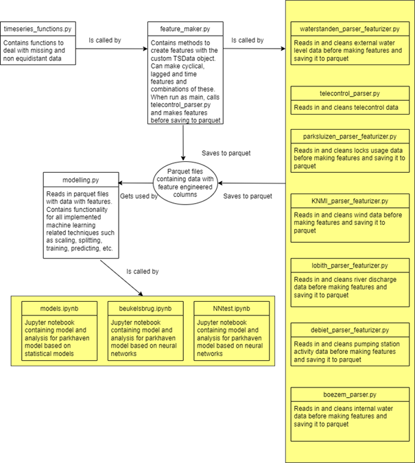

# Readme – zoutindringing parksluizen

This project contains the code and data used for an internship graduation investigation into the possibility of using machine learning to create time series predictions for salt infiltration. The project contains multiple modules used to collect and prepare the data. These modules are shown in the scheme below. Jupyter notebooks are used for loading the feature engineered data and for the final analysis / model training

## telecontrol_parser.py

This module parses data retrieved in csv format from the telecontrol website for Delfland. Sensor errors are set to Nan and a datetime index created with 10 minute interval steps. Repetitions of data (stuck sensors) can be set to Nan with control of the threshold variable.

## *_parser_featurizer.py

These parsers are used to load data retrieved from sources such as WIS, RWS or KNMI and to prepare features for the Jupyter notebooks. This module depends on feature_maker.py and timesereis_function.py. feature engineered data is saved in /data_sets/feats/*-feats as parquet files. The parkhaven data is split into subsets due to large gaps and are saved as csv files in the main directory as {start_date}_{end_date}_{size}.csv files which are used later in the standard run for the feature_maker for parkhaven

## timeseries_funtions.py

This module contains functions to subset time series data and to report and interpolate gaps based on the provided threshold parameter. This module is called by feature_maker.py for preparation for feature engineering on the data that is loaded with the parsers

## feature_maker.py

This module contains the functionality to create features on the parsed and cleaned timeseries data. The class TimeseriesDataset is implemented for this purpose. An object of this class is instantiated with the dataset and the corresponding reference column for which features should be calculated (standard EGV for example). It can has methods for creating lag or difference features with varying lags or strides. More powerful possibilities can be performed with the fm_shifted_rolling() method which allows for custom functions (fm_window_functions()) on any size window with any shift. fm_time() created time related features. fm_get_streak() can be used to calculate activity features. fm_exec_func() with fm_args_combiner() can be used to apply any aforementioned functions to a combination of different window sizes and shifts. fm_create_future_steps() is used to create lag columns into  the future for prediction training purposes. These new columns contain t+ as a identifier which is also uses in the notebooks for splitting the x and y dataframes. This data is saved to /data_sets/feats/*-feats as parquet files

## modelling.py

This module is the backbone of the analysis in the jupyter notebooks. This module uses the feature engineered datastored in parquet files for model training / testing and visualization. The functionality is implemented with the MLdata class. This class has methods for loading parquet feats (for parkhaven setting the subset data). Splitting data in train /test and x /y; cleaning columns (only numerical data); removing any Nan; scaling and reverse scaling for neural networks; custom model usage with sklearn; creating naïve predictions; calculating VIF tolerance values for decreasing multicollinearity and predictor variable size; Creating prediction windows based on a date an supplied predictor data for backtesting

## *.ipynb

These notebooks contain the analysis and results of the project. These use the methods from modelling.py for creating models, predictions and visualizations. models.ipynb contains some analysis on basic statistical methods for Parkhaven, NNtest.ipynb contains the latest neural network implementation and SHAP values for Parkhaven and contains therefore the best model. A similar implementation is used for beukelsbrug.ipynb

